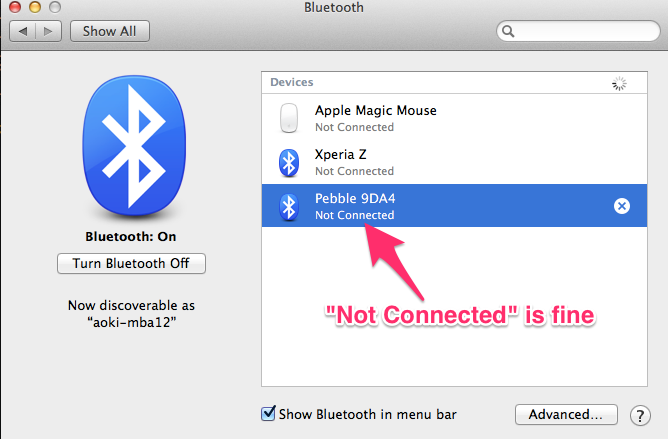

pTunes
=============
pTunes is a software to control iTunes via Pebble

## Before use
Pair your Pebble to Mac




## How to use
Unzip pTunes.zip and open ptunes.app inside.

Input your pebble ID (for example, 9DA4 in my case), 
and push "Connect" button.


Finally you can control iTunes via Music application preinstalled in your Pebble.

## Build
```
$ sudo python setup.py py2app
```
