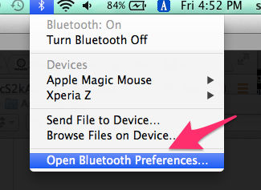
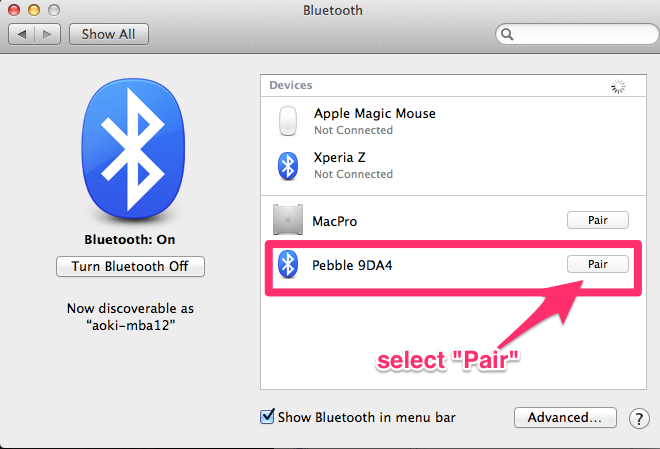

pTunes
=============

### How to pair your pebble to Mac






Change XXXX below to your Pebble ID
```
fin = open("/dev/tty.PebbleXXXX-SerialPortSe")
```

Then,
```
$ python app.py
```

Or try also GUI (require wxPython)
```
$ python ptunes.py
```

